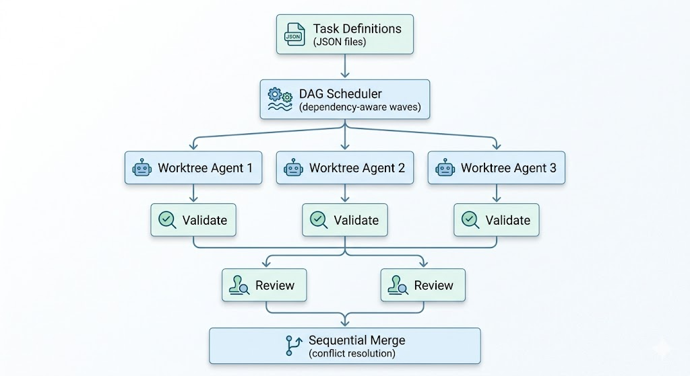

<p align="center">
  <strong>Flywheel</strong><br>
  Worktree-based parallel agent orchestrator for AI-driven coding tasks
</p>

<p align="center">
  <a href="https://github.com/johnayoung/flywheel/actions/workflows/ci.yml"></a>
  <a href="https://goreportcard.com/report/github.com/johnayoung/flywheel"></a>
  <a href="https://pkg.go.dev/github.com/johnayoung/flywheel"></a>
  <a href="LICENSE"></a>
  <a href="https://github.com/johnayoung/flywheel/releases"></a>
</p>

---

Flywheel coordinates multiple AI coding agents executing tasks concurrently in isolated git worktrees. Define your work as a dependency graph, and Flywheel handles scheduling, execution, validation, review, merge, conflict resolution, and crash recovery -- fully automated.

<p align="center">
  
</p>

## Why Flywheel

AI coding agents are powerful but serial -- they work on one thing at a time. Flywheel removes that bottleneck:

- **Parallel execution** -- Multiple agents work simultaneously, each in an isolated git worktree. No interference, no stale state.
- **Dependency-aware scheduling** -- Tasks form a DAG. Flywheel dispatches work in waves, only starting tasks whose prerequisites have merged.
- **End-to-end automation** -- From scheduling through validation, review, merge, and conflict resolution. No manual handoffs.
- **Crash recovery** -- Durable JSONL state store. If Flywheel stops, it resumes exactly where it left off.
- **11-state lifecycle** -- Each task moves through a formal state machine (pending, ready, running, validating, reviewing, merging, merged, ...) with explicit, auditable transitions.

## Install

**From source:**

```
go install github.com/johnayoung/flywheel/cmd/flywheel@latest
```

**Pre-built binaries** are available on the [Releases](https://github.com/johnayoung/flywheel/releases) page (Linux, macOS, Windows -- amd64 and arm64).

**Build locally:**

```
git clone https://github.com/johnayoung/flywheel.git
cd flywheel
make build        # produces ./bin/flywheel
```

## Quick Start

Flywheel runs with zero configuration. In any git repository:

**1. Define tasks** as JSON files in `tasks/`:

```json
{
  "id": "add-logging",
  "description": "Add structured logging to the HTTP handler",
  "category": "feat",
  "priority": 1,
  "prerequisites": [],
  "commit": "feat: add structured logging to HTTP handler",
  "steps": [
    "Add slog-based structured logging to all handler functions",
    "Include request ID, method, path, and duration in each log entry",
    "Add a middleware that injects a logger into the request context"
  ],
  "acceptance_criteria": [
    "All handler functions log request metadata on entry and exit",
    "Log output is JSON-formatted",
    "go build ./... succeeds"
  ]
}
```

**2. Run:**

```
flywheel init     # validate tasks and show the execution plan
flywheel run      # execute -- agents work in parallel across worktrees
flywheel status   # check progress at any time
```

**3. Review and merge** happen automatically (or manually, if configured):

```
flywheel review list
flywheel review approve <id>
flywheel review reject <id> --reason "needs tests"
```

## Configuration

Flywheel works without a config file -- it defaults to the current directory as the repo, `main` as the base branch, `./tasks` for tasks, `claude-code` as the agent, and `max_parallel: 3`. Create `flywheel.json` only when you need to override these:

```json
{
  "version": "1",
  "repo": ".",
  "base_ref": "main",
  "branch_prefix": "flywheel/",
  "max_parallel": 3,
  "build_command": "go build ./...",
  "store": {
    "backend": "jsonl",
    "tasks_path": "./tasks",
    "lifecycle_path": "./.flywheel/lifecycle"
  },
  "merge_strategy": "sequential",
  "review": "agent",
  "agent": "claude-code",
  "timeout": "30m",
  "max_retries": 2,
  "max_resolve_attempts": 2
}
```

| Field | Default | Description |
|---|---|---|
| `repo` | `.` | Path to the git repository |
| `base_ref` | `main` | Branch to create worktrees from and merge into |
| `branch_prefix` | `flywheel/` | Prefix for task branches |
| `max_parallel` | `3` | Maximum concurrent agent workers |
| `build_command` | | Command to validate builds (e.g. `go build ./...`) |
| `merge_strategy` | `sequential` | How completed work is merged |
| `review` | `agent` | Default review mode: `agent`, `human`, or `none` |
| `agent` | `claude-code` | Agent backend for task execution |
| `timeout` | `30m` | Per-task execution timeout |
| `max_retries` | `2` | Retry count on task failure |
| `max_resolve_attempts` | `2` | Retry count for merge conflict resolution |

## Task Schema

| Field | Required | Description |
|---|---|---|
| `id` | yes | Unique identifier (no whitespace) |
| `description` | yes | What the task accomplishes |
| `category` | yes | One of: `feat`, `fix`, `refactor`, `test`, `docs`, `chore` |
| `priority` | no | Numeric priority (lower = higher priority) |
| `prerequisites` | no | Task IDs that must merge before this task starts |
| `commit` | yes | Commit message template |
| `steps` | yes | Ordered implementation steps for the agent |
| `acceptance_criteria` | no | Conditions that must be true when complete |
| `review` | no | Per-task override: `agent`, `human`, or `none` |

## CLI Reference

```
flywheel init                       Validate tasks, build DAG, show execution plan
flywheel run                        Execute the orchestration loop
flywheel run --dry-run              Show plan without executing
flywheel run --max-parallel 5       Override parallelism
flywheel status                     Show all task statuses
flywheel status <id>                Show detail for a single task
flywheel status <id> --lifecycle    Include state transition timestamps
flywheel review list                List tasks awaiting review
flywheel review approve <id>        Approve a completed task
flywheel review reject <id> -r "…"  Reject with reason
flywheel validate tasks             Validate task definitions
flywheel validate dag               Validate dependency graph (cycle detection)
flywheel clean                      Remove worktrees and .flywheel/ state
flywheel clean --worktrees-only     Keep state, remove only worktrees
```

## Architecture

```
cmd/flywheel/          CLI entry point (Cobra)
internal/
  agent/               Agent interface + Claude Code subprocess backend
  config/              Configuration model and loader
  conflict/            Merge conflict detection and agent-based resolution
  dag/                 DAG construction, topological sort, cycle detection, readiness scheduling
  engine/              Orchestration engine -- ties everything together
  lifecycle/           11-state machine with 22 explicit transitions
  merge/               Merge strategies (sequential)
  review/              Agent-based and human-in-the-loop reviewers
  store/               Persistence interface + JSONL file backend
  task/                Task model, validation, JSON parsing
  validate/            Post-execution validation pipeline
  worktree/            Git worktree lifecycle management
```

Key design principle: **tasks** (immutable work definitions) and **lifecycles** (mutable execution state) are separate records. The engine coordinates them through a formal state machine, making the system auditable, recoverable, and easy to reason about.

## State Machine

Tasks move through 11 states with well-defined transitions:

```
pending --> ready --> running --> validating --> reviewing --> merging --> merged
                       |             |             |            |
                       v             v             v            v
                     failed    failed_validation  rejected    conflict
                                     |             |            |
                                     v             v            v
                                   ready          ready      resolving
                                                                |
                                                            merging / failed
```

Every transition is recorded with a timestamp. On crash, Flywheel reads the last known state and resumes from there.

## Prerequisites

- Go 1.26+
- Git 2.x+
- [Claude Code](https://docs.anthropic.com/en/docs/claude-code) CLI (for the `claude-code` agent backend)

## Contributing

```
make test       # run tests with race detection
make vet        # static analysis
make fmt        # format code
make cover      # generate coverage report
```

All packages live under `internal/` -- this is a standalone tool, not a library. Tests live alongside source files.

## License

[MIT](LICENSE)
