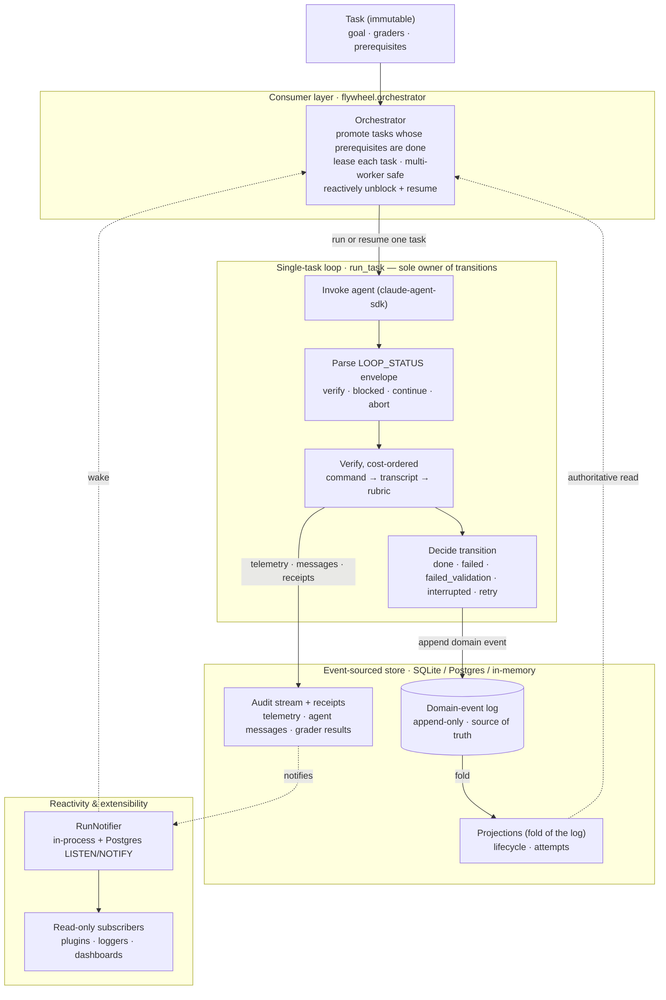

# Flywheel

Production-grade orchestration loop for AI coding agents.

## Status: pre-release (WIP)

Flywheel is under active development. Public APIs, task and lifecycle
schemas, CLI flags, and on-disk layouts may change without notice between
commits. Pin to a specific commit if you depend on this code, and expect
breaking changes until a tagged 1.0 release.

## Architecture

Flywheel is layered. A **consumer** decides *which* task to run; a
**single-task loop** owns *executing* one task; an **event-sourced store**
is the source of truth; a **reactive** layer pushes change to followers.

- **Harness** (`flywheel.harness.run_task`) is the sole owner of lifecycle
  transitions. It invokes the agent, parses the `LOOP_STATUS` envelope
  (agent claims are untrusted), verifies the result through cost-ordered
  graders, and decides the next transition — done, retry, fail, or pause.
- **Event-sourced lifecycle.** Every state change is appended to a
  domain-event log; the lifecycle and its attempts are projections folded
  from that log, so state and timeline can never diverge. Grader receipts
  and the agent transcript are recorded alongside as append-only history.
- **Reactivity.** A notifier signals on every store write — in-process, or
  across hosts via Postgres `LISTEN`/`NOTIFY` — so followers react instead
  of polling. Read-only subscribers observe the audit stream without ever
  touching authoritative state.
- **Orchestrator** (`flywheel.orchestrator`) reads authoritative state to
  promote tasks whose prerequisites are done, leases each task so multiple
  workers never run the same one, and reactively unblocks and resumes paused
  work — without ever transitioning a lifecycle itself.


```mermaid
flowchart TB
    Task["Task (immutable)<br/>goal · graders · prerequisites"]

    subgraph Consumer["Consumer layer · flywheel.orchestrator"]
        Orch["Orchestrator<br/>promote tasks whose prerequisites are done<br/>lease each task · multi-worker safe<br/>reactively unblock + resume"]
    end

    subgraph HarnessLoop["Single-task loop · run_task — sole owner of transitions"]
        Invoke["Invoke agent (claude-agent-sdk)"]
        Env["Parse LOOP_STATUS envelope<br/>verify · blocked · continue · abort"]
        Grade["Verify, cost-ordered<br/>command → transcript → rubric"]
        Decide["Decide transition<br/>done · failed · failed_validation · interrupted · retry"]
        Invoke --> Env --> Grade --> Decide
    end

    subgraph StoreBox["Event-sourced store · SQLite / Postgres / in-memory"]
        Log[("Domain-event log<br/>append-only · source of truth")]
        Proj["Projections (fold of the log)<br/>lifecycle · attempts"]
        Audit["Audit stream + receipts<br/>telemetry · agent messages · grader results"]
        Log -->|fold| Proj
    end

    subgraph ReactBox["Reactivity & extensibility"]
        Notify["RunNotifier<br/>in-process + Postgres LISTEN/NOTIFY"]
        Subs["Read-only subscribers<br/>plugins · loggers · dashboards"]
    end

    Task --> Orch
    Orch -->|run or resume one task| Invoke
    Decide -->|append domain event| Log
    Grade -->|telemetry · messages · receipts| Audit
    Proj -. authoritative read .-> Orch
    Audit -. notifies .-> Notify
    Notify --> Subs
    Notify -. wake .-> Orch
```

See [docs/task-lifecycle.md](docs/task-lifecycle.md) for the lifecycle state
machine and [docs/vision.md](docs/vision.md) for the design principles.

## Quickstart

All paths and commands below are relative to the repo root.

**1. Confirm Python 3.13.** Flywheel requires Python 3.13 or newer; check
with `python3 --version` before continuing.

**2. Install [uv](https://docs.astral.sh/uv/getting-started/installation/),
then clone and install dependencies:**

```bash
git clone https://github.com/johnayoung/flywheel
cd flywheel
uv sync
```

**3. Write a minimal `task.json` at the repo root:**

```json
{
  "id": "readme-quickstart",
  "goal": "Print the string 'hello flywheel' to stdout.",
  "graders": [
    {
      "type": "command",
      "name": "smoke",
      "run": "echo hello flywheel | grep -q 'hello flywheel'"
    }
  ]
}
```

**4. Run the task through the workflow CLI:**

```bash
uv run python -m flywheel.workflow run task.json
```

The command exits `0` when the lifecycle reaches `done` and non-zero
otherwise. Lifecycle state is persisted to `.workflow/flywheel.sqlite`.

## Documentation

- [docs/vision.md](docs/vision.md) -- what flywheel is, and what it is not.
- [docs/task-schema.md](docs/task-schema.md) -- `Task`, `Grader`, and `Context` shapes plus validation rules.
- [docs/task-lifecycle.md](docs/task-lifecycle.md) -- lifecycle states, attempts, and transition rules.
- [docs/loop.md](docs/loop.md) -- iteration envelope (`LOOP_STATUS`) and harness behavior.
- [docs/strategy.md](docs/strategy.md) -- submission strategy (currently deferred).

## Contributing

Issues and pull requests are welcome at
<https://github.com/johnayoung/flywheel>. Read
[CONTRIBUTING.md](CONTRIBUTING.md) first for dev setup, test commands, and
the commit-message convention.

## License

License: TBD. No `LICENSE` file ships with this repository yet -- do not
assume any license is granted for reuse or redistribution.
