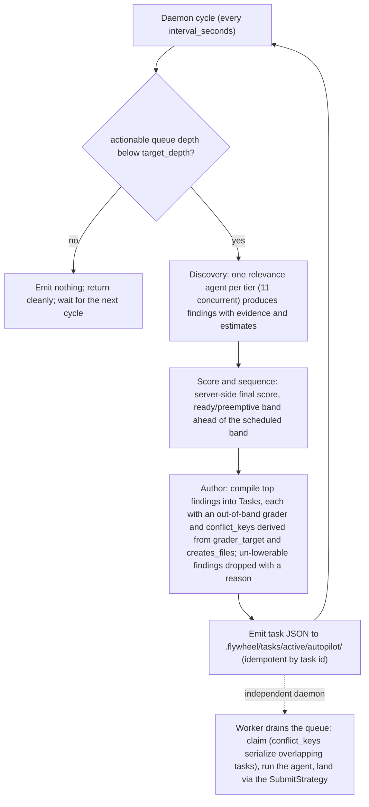

# Autopilot

Autopilot is a neverending **intake** daemon: each cycle it discovers work, scores it against the tier model below, compiles the top candidates into verifiable [tasks](task-schema.md), and emits them into the work queue until it reaches a target depth. It authors work; the [worker](orchestration.md) drains it. The two are independent supervised daemons.

The engine lives in `flywheel_orchestrator._autopilot`; the CLI/daemon shell in `flywheel_orchestrator._autopilot_run`; the console supervisor in `flywheel._autopilot_supervisor`.

**Autopilot writes to the base branch unattended.** It is never auto-spawned on console launch (the worker is) — an operator must start it explicitly. See [The operator console](#the-operator-console).

## What autopilot is

A neverending daemon that keeps the work queue full with verifiable, tier-prioritized tasks. It contrasts with the worker:

| Daemon | Role | Verb | Auto-spawn on console |
| --- | --- | --- | --- |
| Worker | Drains the queue: claims a task, runs the agent, lands the verified result | `flywheel worker` | Yes |
| Autopilot | Fills the queue: discovers, scores, authors, and emits tasks | `flywheel autopilot` | No (writes the base branch unattended) |

Autopilot emits plain core `Task`s (`docs/task-schema.md`), each carrying at least one grader; the worker picks them up through the normal selection/claim/submit path and lands them via the configured [SubmitStrategy](strategy.md). Autopilot has no privileged channel into the loop — it only writes task files.

## The refill pass

One refill pass (`run_refill_pass`, `_autopilot.py:1059`) composes four stages and fills the queue **only up to the target depth, from actionable findings only** — never always-busy filler. It is headless and logs to stderr with an `[autopilot]` prefix (`make_logger`, `_autopilot_run.py:37`).



1. **Discovery** (`run_discovery`, `_autopilot.py:616`) — fans out **one relevance agent per tier**, 11 concurrent invocations. Each agent reads the repo, judges whether its tier is relevant to this codebase, and returns a `TierVerdict` with zero or more findings carrying evidence plus 0–10 estimates for urgency, importance, blocks, and effort, and a `ready` flag. Relevance is agent-judged per repo, never coded detectors. The fan-out is best-effort: it always returns exactly 11 verdicts, even if every agent errors, and a not-relevant verdict always carries zero findings. Findings are stamped with their tier server-side, not by the agent.
2. **Score** (`sequence_findings`, `_autopilot.py:262`) — applies [the scoring model](#the-scoring-model) to every finding from relevant tiers, partitioning the ready preemptive band ahead of the scheduled band, each ordered by descending score. The final score is computed here, never agent-reported; the agent only supplies the input estimates.
3. **Author** (`author_finding`, `_autopilot.py:880`) — each selected finding is compiled by an agent into one or more validated core `Task`s, each with at least one grader. **The authoritative grader must be out-of-band** — a pre-existing committed repo check (`repo_command`) or a registered held-out oracle (`held_out_oracle`), never a check the same task's own diff creates. A self-attestation guard (`_validate_task_entry`, `_autopilot.py:765`) drops any task whose authoritative grader names or equals a file the task creates. A finding that cannot be lowered to such a task is **dropped with a recorded reason**, never written as a stub. Ambiguities a human would be asked about are recorded as `assumptions` on the emitted task.
4. **Emit** (`emit_emitted_task`, `_autopilot.py:1032`) — writes each task to `<tasks_dir>/active/autopilot/<task_id>.json`. The file carries `priority` (derived from the final score so the scheduler orders it) and an `autopilot` provenance block recording the full score breakdown and grader metadata, keeping the recommendation auditable. **Idempotent:** if the target file already exists it is not overwritten, so re-running autopilot never duplicates in-flight work.

On a clean repo with nothing actionable, a pass writes zero tasks and returns cleanly — it never raises and never invents filler. If the queue is already at or above target depth, the pass returns early and emits nothing.

## Running autopilot

`flywheel autopilot` (and the identical `fw autopilot`) is a **neverending daemon by default**; `--once` runs a single refill pass and exits 0. This mirrors `flywheel worker` (daemon by default, `--once` for one drain). See [cli.md](cli.md).

```bash
flywheel autopilot                      # neverending daemon (default interval 300s)
flywheel autopilot --once               # one refill pass, then exit 0
flywheel autopilot --target-depth 8     # fill to depth 8 this run
flywheel autopilot --interval 120       # 120s between daemon cycles
```

| Flag | Type | Effect |
| --- | --- | --- |
| `--tasks-dir` | path | Work queue directory (overrides `[work].tasks_dir`) |
| `--model` | string | Agent model for discovery and authoring (overrides `[work].model`) |
| `--target-depth` | int | Fill the queue to this depth (overrides `[autopilot].target_depth`) |
| `--interval` | float | Seconds between daemon cycles (overrides `[autopilot].interval_seconds`) |
| `--once` | flag | Run one refill pass and exit; no daemon loop |

Flag precedence is CLI flag > policy > code default (`_resolve_runtime`, `_autopilot_run.py:87`). `landing` and the score weights come from policy only (no CLI flag).

**The daemon never terminates on an idle cycle.** An empty pass writes nothing and the loop continues; it exits only on SIGTERM or SIGINT, finishing the current cycle first (`run_daemon_loop`, `_autopilot_run.py:136`). A policy error exits 2 before the loop starts.

## Configuration

The optional `[autopilot]` table and `[autopilot.weights]` sub-table bind into `WorkPolicy` (`_policy.py:1140`). A malformed value raises `PolicyError` so a typo never silently degrades autopilot. See [configuration.md](configuration.md).

```toml
[autopilot]
target_depth     = 5        # positive int; fill the queue to this depth
landing          = "merge"  # "merge" (FF-merge) or "pr"
interval_seconds = 300.0    # positive float; seconds between daemon cycles
```

| Key | Type | Default | Controls |
| --- | --- | --- | --- |
| `target_depth` | int | `5` | Queue depth the refill pass fills to |
| `landing` | string | `merge` | Submit strategy for emitted work: `merge` (FF-merge) or `pr` |
| `interval_seconds` | float | `300.0` | Seconds between daemon cycles |

The model is not under `[autopilot]` — it comes from the top-level `[work].model`.

`[autopilot.weights]` overrides individual scoring weights; every unset weight keeps its engine default (`ScoreWeights`, `_autopilot.py:99`).

| Weight | Default | Score term |
| --- | --- | --- |
| `tier` | `10.0` | Tier-weight contribution (`w_tier`) |
| `urgency` | `3.0` | Urgency contribution (`w_urg`) |
| `importance` | `3.0` | Importance contribution (`w_imp`) |
| `unblock` | `2.0` | Per-blocked-item contribution (`w_unblock`) |
| `effort` | `1.0` | Effort penalty (`w_effort`) |
| `interrupt_base` | `10000.0` | Floor added to ready preemptive findings (`INTERRUPT_BASE`) |

```toml
[autopilot.weights]   # all optional; an unset weight keeps the engine default
tier           = 10.0
urgency        = 3.0
importance     = 3.0
unblock        = 2.0
effort         = 1.0
interrupt_base = 10000.0
```

## The operator console

From the interactive console, `/autopilot start` spawns the neverending autopilot daemon as a detached supervised child; `/autopilot stop` SIGTERMs it (`handle_autopilot_slash`, `_dashboard.py:1022`). It mirrors `/worker start|stop` but runs independently — starting or stopping autopilot never touches the worker. See [cli.md](cli.md).

**Autopilot is never auto-spawned on console launch, unlike the worker, because it writes to the base branch unattended — start it explicitly.** The supervisor is constructed so its status surface and the `/autopilot start` action exist, but nothing spawns until the operator opts in (`_tui.py:397`).

- `start` is idempotent — an already-supervised daemon is left unchanged (no second daemon). The console spawns the continuous daemon, never `--once`.
- The daemon spawns in its own session (`start_new_session=True`), so console Ctrl+C never reaches it and it **survives console exit**. The next console does not adopt a surviving daemon — autopilot writes no claim lease, so there is no detached-adoption state.
- `stop` SIGTERMs the child and waits up to 10 seconds; it acts only when this console owns the daemon, otherwise it reports "no supervised autopilot to stop".

For where autopilot sits in the spec/plan/verify/execute/retro pipeline — it is the unattended intake half — see [workflow.md](workflow.md); for how emitted work lands, see [strategy.md](strategy.md).

---

## The scoring model

### Tier hierarchy

**Tiers 1–3 are preemptive interrupts**: whenever one is `ready`, it floats above everything else. **Tiers 4–11 are scheduled by weighted score**, not strict ordering. (`Tier`, `_autopilot.py:45`; the `<= 3` preemptive boundary lives in `PREEMPTIVE_MAX_TIER`, `_autopilot.py:74`.)

| Tier | Class                             | Mode       | Description                                                                                                                    |
| ---- | --------------------------------- | ---------- | ------------------------------------------------------------------------------------------------------------------------------ |
| 1    | Production down / active harm     | Preemptive | Outages, in-progress data loss, active breach, payments failing. Nothing below advances while open.                            |
| 2    | Imminent severe risk              | Preemptive | Actively/trivially exploitable vuln, spreading corruption, hard-deadline compliance violation, dependency about to break prod. |
| 3    | Broken build / blocked pipeline   | Preemptive | CI red, main can't deploy, team blocked from shipping. Blocks everyone's forward motion.                                       |
| 4    | Committed deliverables at risk    | Scheduled  | Work with external commitments (customer deadlines, contracts, dependent teams) about to slip.                                 |
| 5    | Core feature work                 | Scheduled  | The roadmap — new functionality delivering primary value. Default steady state.                                                |
| 6    | Test coverage (shipped/in-flight) | Scheduled  | Tests for code that exists or is being written. Untested code becomes tomorrow's Tier 1.                                       |
| 7    | Non-critical bugs                 | Scheduled  | Known defects, not blocking or severe. System functions.                                                                       |
| 8    | Tech debt / refactoring           | Scheduled  | Cleanup that improves velocity and reduces risk.                                                                               |
| 9    | Observability & tooling           | Scheduled  | Logging, metrics, dashboards, dev ergonomics. Compounding dividends, rarely urgent.                                            |
| 10   | Documentation                     | Scheduled  | READMEs, API docs, runbooks, onboarding. Valuable, almost never time-critical.                                                 |
| 11   | Polish / nice-to-have             | Scheduled  | Cosmetic tweaks, minor optimizations, "wouldn't it be nice."                                                                   |

`TierWeight[Tier]` is `12 - tier.value` (tier 1 → 11, tier 11 → 1; `TIER_WEIGHTS`, `_autopilot.py:81`).

### Scoring

```
if Tier <= 3 and Status == ready:
    Score = INTERRUPT_BASE + (Urgency * w_urg)   // always floats above everything

else:
    Score = (TierWeight[Tier] * w_tier)
          + (Urgency          * w_urg)
          + (Importance       * w_imp)
          + (BlocksCount      * w_unblock)     // doing it frees others
          - (Effort           * w_effort)      // cheap wins surface sooner
```

Urgency is a static agent-supplied 0–10 estimate; the scoring engine consumes it as-is and never escalates it over time. The engine has no clock, deadline, or `now` input.

The shipped weight defaults are `w_tier=10`, `w_urg=3`, `w_imp=3`, `w_unblock=2`, `w_effort=1`, `INTERRUPT_BASE=10000` (`_autopilot.py:90`); all are tunable via `[autopilot.weights]`. `INTERRUPT_BASE` is large enough that any ready preemptive finding outscores every possible scheduled score, and `sequence_findings` also partitions the two bands before sorting, so the override is absolute by both arithmetic and partition. A Tier 1–3 finding that is not `ready` falls through to the scheduled branch and still scores (with its high tier weight). The recorded breakdown (`ScoreBreakdown`, `_autopilot.py:152`) persists every component plus the `preemptive` flag, so `recompute_final` (`_autopilot.py:241`) can re-derive the score from the recorded inputs.

---

## Logic Behind the Split

**Why preemptive vs. scheduled.** A pure top-down hierarchy — always work the highest non-empty tier — starves the lower tiers forever, because there is always *some* feature or bug sitting at Tier 4–7. Documentation and tech debt then get touched *never*. That is exactly how real projects accumulate crippling debt and zero docs.

Strict priority ordering is correct for **interrupts** but wrong for **steady-state allocation**:

- **Tiers 1–3 (preemptive):** these genuinely should preempt everything. "If production is down, fix it" is absolute. While any of these is `ready`, nothing below advances.
- **Tiers 4–11 (scheduled):** below the interrupt line, work is allocated by *weighted score*, not by draining one tier before touching the next. This keeps lower tiers alive instead of leaving them as dead weight.

**Why urgency and importance are separate axes.** A one-dimensional hierarchy can't express "low urgency, but do it *now* because the window closes" — e.g. the only engineer who understands a subsystem leaves Friday. Importance = value/risk-reduction if done, independent of *when*. Urgency = how fast cost grows if untouched. A high urgency estimate is what lets a normally-low item rise without hard-coding exceptions. (Design rationale, not yet implemented: the engine treats urgency as a static agent estimate and does not escalate it by clock — there is no deadline-driven urgency mechanism in the shipped scoring code.)

**Why the score must be legible.** Expose the breakdown (tier, urgency, importance, unblock contributions), not just the final number. A subtly miscalibrated single score steers the whole project wrong and nobody notices until the damage is done. The weights are tuning knobs and will be wrong at first — treat the score as an inspectable recommendation, not ground truth.
