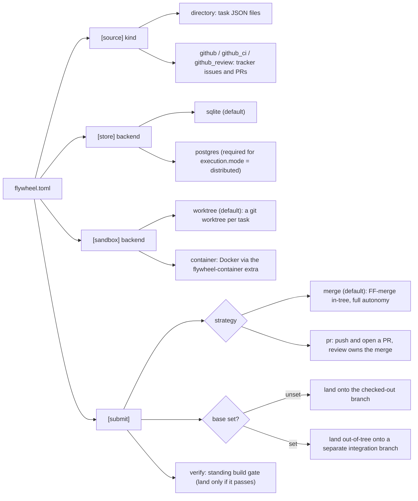

# Configuration (flywheel.toml)

A single `flywheel.toml` at the repo root is the consumer repo's versioned contract with the orchestrator: where work comes from, what "runnable" means by default, and how finished work lands. Switching a project between a task directory and an issue tracker is a committed config change, not a flywheel code change.

One module owns the whole surface: `flywheel_orchestrator._policy.load_policy` (`_policy.py:476`) parses the file with stdlib `tomllib` into a frozen `WorkPolicy` (`_policy.py:383`). Every key is validated there, every default lives there.

## Precedence and validation

- **Precedence**: an explicit CLI flag wins over the file, the file wins over the built-in default. The read commands (`status`, `live`, `worker`, `autopilot`, ...) auto-detect `flywheel.toml` in the cwd (`_workflow.py:798`); `--policy` overrides the path, and an explicit `--tasks-dir`/`--db`/`--sandbox-root`/`--model` always beats the file.
- **Strict on values, lenient on keys**: a wrong-typed or out-of-enum value fails fast with a `PolicyError` that names the offending file and key — a typo never silently degrades behavior. Unknown *keys* under a known table, and unknown *section* tables, are ignored for forward-compatibility (`_optional_*` helpers).
- **`[source]` is the only required table.** Its absence raises `PolicyError` "missing required `[source]` table" (`_policy.py:489`). Every other section is optional; an absent section yields a back-compat default so a pre-existing file keeps loading unchanged.
- **Credentials and DSNs never live in the file.** Postgres DSNs, API tokens, and OAuth tokens are read from named environment variables only (see [Environment variables](#environment-variables)). Config carries env var *names*, never values.

## Sections at a glance

| Section | Required | Purpose | Deep dive |
|---------|----------|---------|-----------|
| `[source]` | yes | where work comes from (kind + per-kind settings) | [work-sources.md](work-sources.md) |
| `[paths]` | no | where runtime state lives (db, sandbox root) | this doc |
| `[agent]` | no | agent model id | this doc |
| `[[defaults.graders]]` | no | default graders for tracker work items | [task-schema.md](task-schema.md) |
| `[store]` | no | persistence backend (sqlite/postgres) | this doc |
| `[execution]` | no | mode (local/distributed) + advertised capabilities | [orchestration.md](orchestration.md) |
| `[worker]` | no | worker pool size (concurrency), checkpoint-nudge threshold, session-pause ceiling | this doc |
| `[submit]` | no | how DONE work lands (strategy, protected paths) | [strategy.md](strategy.md) |
| `[phase]` | no | phase-exit verify gate | this doc |
| `[held_out]` | no | execute-time held-out landing gate | [held-out-gate.md](held-out-gate.md) |
| `[autopilot]` | no | intake-daemon cadence + scoring weights | [autopilot.md](autopilot.md) |
| `[deadlines]` | no | default-on wall-clock ceilings for the five external-call classes | this doc |
| `[sandbox.*]` | no | provisioning + the agent's execution environment | [sandbox.md](sandbox.md) |

The main axes and what each selects — the "how config changes the path" view:



See [strategy.md](strategy.md) for the full landing decision tree these `[submit]` keys drive.

## `[source]` (required)

Where work comes from. `kind` selects the `WorkSource` backend; the remaining keys are per-kind. See [work-sources.md](work-sources.md) for each kind's listing/grading behavior.

| Key | Type | Default | Applies to | Controls |
|-----|------|---------|------------|----------|
| `kind` | enum `directory`/`github`/`github_ci`/`github_review` | (required) | all | which `WorkSource` backend builds |
| `tasks_dir` | path | `.flywheel/tasks` | `directory` | root of `active/<phase>/*.json` task files |
| `repo` | `owner/name` | (required) | `github`/`github_ci`/`github_review` | the GitHub repo the `gh` CLI targets |
| `label` | str | (required) | `github` | only issues carrying this label are listed |
| `done_action` | enum `comment`/`close` | `comment` | `github` | post the outcome as a comment, or close the issue |
| `failure_filter` | str | `failure` | `github_ci` | `gh run --status` filter for which CI runs become work |

`github_review` lists unresolved PR review threads; its grade is the policy's `[[defaults.graders]]` run out-of-band, never the thread's `isResolved` state (`_policy.py:1644`).

## `[paths]` (optional)

Where runtime state lives. When a key is unset the CLI falls back to its built-in default (`_policy.py:392`).

| Key | Type | Default | Controls |
|-----|------|---------|----------|
| `db` | path | `.flywheel/flywheel.sqlite` | SQLite store location |
| `sandbox_root` | path or token | `.flywheel/worktrees` | root under which each task's worktree/sandbox is created |

`sandbox_root` resolution (`resolve_sandbox_root`, `_policy.py:755`): a relative path anchors at the repo root (never the process cwd); an absolute path is used verbatim; two tokens opt into out-of-tree layouts:

- `@cache` — `<cache-base>/flywheel/<repo-name>-<id>/worktrees`, where `<cache-base>` is the first writable of `$XDG_CACHE_HOME`, `~/.cache`, and the platform tmpdir, and `<id>` keys the repo by the realpath of its git common dir (clones never collide; a linked worktree maps to its main repo).
- `@sibling` — `<repo-parent>/<repo-name>.worktrees`; refused at startup (`PolicyError`) when the parent directory is read-only (CI mounts).

Both `flywheel worker` and `flywheel orchestrate` honor the key; `--sandbox-root` overrides it. When the resolved root differs from the legacy `.flywheel/worktrees`, the worker's retention sweep also covers the legacy directory while it exists, so worktrees created before a relocation still age out. An out-of-tree root stays out of docker build contexts by construction; for the default nested root, `flywheel init` appends `.flywheel/` to `.dockerignore` when a Dockerfile is present (docker does not read `.gitignore`).

## `[agent]` (optional)

| Key | Type | Default | Controls |
|-----|------|---------|----------|
| `model` | str (opaque) | unset | the model id passed verbatim to the SDK |
| `id` | str (opaque) | unset | the multi-agent opt-in: routes every agent invocation (worker, rubric judge, recovery summarizer, conflict resolver, autopilot) through the `flywheel-agents` runtime (`"claude-code"` and `"codex"` ship); unset keeps the legacy SDK invoker |
| `transport` | str | unset | adapter transport selection (claude-code: `"cli"` or `"sdk"`); requires `id` |

Values are opaque: flywheel maintains no allowlist. Model resolution precedence is `--model` flag > `[agent] model` > SDK/Claude Code default (`worker.py:2060`). An empty or whitespace-only string raises `PolicyError`, as does `transport` without `id`. An unknown `id` fails at run time with the registered adapter set in the message. See [agent-harness.md](agent-harness.md) for the multi-agent architecture.

## `[[defaults.graders]]` (optional)

Default grader policy, parsed as the standard `Grader` array via `flywheel_core.loaders.load_graders` (`_policy.py:502`). See [task-schema.md](task-schema.md) for the `Grader` shape.

**Meaningful only for tracker sources** (`github`/`github_ci`/`github_review`): applied to a work item that declares no graders of its own. Directory task files always carry their own graders (the schema requires at least one), so the default is inert for `directory`. A tracker item with no graders and no default policy is not runnable and never reaches the scheduler.

```toml
[[defaults.graders]]
type = "command"
run = "uv run pytest"
```

## `[store]` (optional)

Persistence backend. An absent section means `sqlite` (`_policy.py:888`).

| Key | Type | Default | Controls |
|-----|------|---------|----------|
| `backend` | enum `sqlite`/`postgres` | `sqlite` | persistence backend |
| `schema` | str (postgres only) | unset | Postgres schema name |

The Postgres DSN is never configured here; it comes from the environment (see below).

## `[execution]` (optional)

Distribution and capability matching. See [orchestration.md](orchestration.md).

| Key | Type | Default | Controls |
|-----|------|---------|----------|
| `mode` | enum `local`/`distributed` | `local` | distribution posture |
| `capabilities` | list of str | `[]` | this worker's advertised capability set |

**`mode = "distributed"` requires `store.backend = "postgres"` or `load_policy` raises** (`_policy.py:531`). That postgres requirement is `mode`'s *only* runtime effect: `execution_mode` is a pure load-time validation assertion (`_policy.py:408`) — it is never read by any scheduler/claim/lease code path, so it does not itself change how work is scheduled, claimed, or leased. `capabilities` is the *worker's* advertised set: the scheduler offers this worker only items whose `required_capabilities` is a subset of it. This is distinct from `[sandbox.capabilities]`, which is the *agent's* tool/skill/MCP surface inside the sandbox.

## `[worker]` (optional)

Worker pool size, checkpoint-nudge threshold, and session-pause ceiling for a single `flywheel worker` invocation.

| Key | Type | Default | Controls |
|-----|------|---------|----------|
| `concurrency` | int (>=1 once resolved) | `1` | how many tasks one `flywheel worker` invocation drives concurrently |
| `checkpoint_nudge_seconds` | float (>= 0) | `300.0` | remaining wall time to a task's `AGENT_ITERATION` deadline at which the harness nudges the agent to commit work-in-progress, when its branch has gained no new commit; `0` disables |
| `session_pause_ceiling_seconds` | float (>= 0) | `21600.0` | ceiling (seconds) clamping a session-limit-driven pool-wide claim pause; `0` disables pausing entirely |

`--concurrency` overrides this value per-run (flag wins). An absent `[worker]` table means `concurrency = 1` — single serial worker, today's behavior byte-for-byte. A resolved value below `1` (e.g. `--concurrency 0`, a negative, or a non-integer flag) is a hard error: the worker exits non-zero naming the setting and claims no task (`_resolve_concurrency`, `worker.py`). The `< 1` range is *not* checked at load time because the flag can override the config, so a config of `0` with `--concurrency 3` is valid.

`checkpoint_nudge_seconds` is **default-on**: an absent `[worker]` table still nudges (300s), because the retro loss came from this behavior not existing. The worktree worker binds a git progress probe per run — the nudge fires at most once, only when the sandbox branch has no new commit as the deadline nears, and never moves the deadline (the iteration is still cancelled at its ceiling). The threshold is measured against the resolved `AGENT_ITERATION` ceiling, so `[deadlines]` operator overrides flow through automatically. `0` disables the nudge. The container backend does not wire the probe (nudge dormant there).

`session_pause_ceiling_seconds` is **default-on** (21600.0 = 6h): when any run surfaces a structural session-limit reset (the harness's `HarnessOutcome.session_limit_reset`, never parsed from an error string), the orchestrator records a pause behind the shared claim store with `pause_until = min(reset, now + ceiling)`. While that horizon is in the future, **every** driver against the same claim store (in-memory, SQLite, or Postgres) declines fresh and resume claims pool-wide — bookkeeping (lease sweeps, reconcile, redrives, snapshots) is unaffected — and claiming resumes on its own once it passes. The ceiling bounds how long one derived reset can hold the pool off claiming, so a far-future reset never yields an unbounded pause; a reset already in the past never records a pause. Each pause is a queryable ledger row plus a stream log line naming `pause_until` and its cause. `0` disables pausing entirely (today's behavior byte-for-byte).

## `[submit]` (optional)

How DONE work leaves the loop. An absent table means historical merge landing. See [strategy.md](strategy.md) for the shipped strategies and the protected-paths contract.

| Key | Type | Default | Controls |
|-----|------|---------|----------|
| `strategy` | enum `merge`/`pr`/`phase` | `merge` | how DONE work lands; routed via the `SUBMIT_STRATEGIES` registry; ignored for routing when `[[submit.tiers]]` is configured |
| `protected_paths` | list of glob | `[]` | repo-relative globs (`PurePath.full_match`, `**` crosses dirs) a finished branch may not touch; a match refuses landing and parks the work |
| `remote` | str | `origin` | `pr` strategy push target |
| `pr_base` | str | unset (worker base branch) | `pr` strategy PR base branch |
| `base` | str | unset (checked-out branch) | explicit landing/phase-base branch |
| `verify` | str (shell) | unset (no gate) | standing build invariant re-run under the merge lock against the exact tree about to become the base, on every land path; a non-zero exit refuses landing and parks the work (`park_kind="standing-verify"`) |
| `recovery_agent_max_turns` | int (>= 0) | `30` | turn ceiling for the bounded conflict-resolution session on the `merge` strategy's fallback rung; `0` disables the rung (a merge conflict parks exactly as before) |
| `recovery_agent_max_wall_seconds` | float (> 0) | `900.0` | wall-clock ceiling for that same session; the session is cancelled and the run parks preserved when it is exceeded |

`protected_paths` is honored by both strategies (`worker.py:772`); it protects the verification surface — grader configs, CI, harness state — from being rewritten by the work it judges.

`verify` is the "trunk must always build" gate (spec 00064): repo-wide and independent of the task's own (often crate-scoped) command graders, it catches a *semantic merge skew* where two independently-valid changes union into a tree that does not build. It runs serialized under the merge lock — a slow command bottlenecks landings — and inherits the resolved `[sandbox.env]`. Example: `verify = "cargo build --workspace --tests"` or `verify = "uv run pytest"`.

`recovery_agent_max_turns` / `recovery_agent_max_wall_seconds` arm the `merge` strategy's last recovery rung (spec 00077): when FF, rebase, and the merge-fallback all hit a textual conflict, a single bounded agent session resolves the conflict markers and stages the result. The resolved tree lands only after re-running the task's command graders, `[submit] verify`, and the declared held-out gate — the same out-of-band bar every other land clears; any failure parks the run preserved with the session's turn/wall usage recorded on the ledger. A land from this rung records `rung="agent-resolved"`. Both bounds are wrong-type / out-of-range validated at load (a bad value raises `PolicyError` naming the key) so a typo never silently disables or unbounds the rung. Setting `recovery_agent_max_turns = 0` keeps the historical merge-conflict park.

### `[[submit.tiers]]` (optional, spec 00080)

Risk-tiered landing: route each DONE task by the highest tier its changed files classify at, instead of one repo-global strategy. Array of tables, each with exactly `tier` and `paths`:

```toml
[[submit.tiers]]
tier = 0                      # lands via merge, direct
paths = ["docs/**", "*.md"]

[[submit.tiers]]
tier = 2                      # lands via pr, human approval
paths = ["scripts/**"]
```

- Tiers: `0` = merge (direct), `1` = phase integration branch, `2` = PR. Highest tier of any touched file wins; a file matching no rule defaults to tier `1`.
- `paths` use `protected_paths` glob semantics (`PurePath.full_match`, `**` crosses dirs) over the branch's merge-base-scoped diff.
- Classification is worker-side only; the policy file itself always classifies tier `2`, so a branch editing these rules cannot cheapen its own route.
- `protected_paths` outranks every tier (a protected file parks; tier 2 is a landing route, protection is a refusal).
- Each decision is recorded on the run's ledger (`LandingRouted`: per-file tiers, winning tier, strategy).
- Absent: landing is byte-identical to `[submit] strategy`.

## `[phase]` (optional)

| Key | Type | Default | Controls |
|-----|------|---------|----------|
| `verify` | str (shell) | unset (no gate) | command run against the merged phase base once every task in a phase has landed; a non-zero exit leaves the phase active |

Consumed at `worker.py:1087`. Unset means today's archival behavior with no gate.

## `[held_out]` (optional)

Execute-time held-out landing gate. See [held-out-gate.md](held-out-gate.md).

| Key | Type | Default | Controls |
|-----|------|---------|----------|
| `root` | path | unset (no gate) | directory of operator-declared held-out grader registrations (one `<task_id>.json` per gated task) the gate reads |

**There is deliberately no default `root`.** Unset means the worker builds no held-out source and landing is byte-identical to today (`_policy.py:1116`); a default would silently activate gating on upgrade. A relative `root` resolves against the repo root (`worker.py:2241`).

## `[autopilot]` and `[autopilot.weights]` (optional)

Intake-daemon cadence and the score-axis weights. See [autopilot.md](autopilot.md) for the tier hierarchy and weighted scoring model.

| Key | Type | Default | Controls |
|-----|------|---------|----------|
| `target_depth` | int (>0) | `5` | how deep autopilot fills the queue |
| `landing` | enum `merge`/`pr` | `merge` | landing posture for autopilot-authored work |
| `interval_seconds` | float (>0) | `300.0` | seconds between daemon cycles |

`[autopilot.weights]` overrides individual score axes; each unset weight keeps the engine default (`ScoreWeights`, `_autopilot.py:100`).

| Key | Type | Default |
|-----|------|---------|
| `tier` | float | `10.0` |
| `urgency` | float | `3.0` |
| `importance` | float | `3.0` |
| `unblock` | float | `2.0` |
| `effort` | float | `1.0` |
| `interrupt_base` | float | `10000.0` |

The autopilot CLI flags `--target-depth`/`--interval`/`--model` override the corresponding `[autopilot]` keys (`_autopilot_run.py:65`).

## `[deadlines]` (optional)

Default-on, per-class wall-clock ceilings (seconds) for the five external-call classes flywheel issues (spec 00066, `deadline_config.py`). **Every class ships a finite default; set a key to `0` to opt that class out (unbounded).** TOML cannot express `None`, so `0` is the on-disk spelling of the unbounded opt-out — an omitted key keeps its default, leaving a pre-existing file byte-identical.

| Key | Type | Default | Controls |
|-----|------|---------|----------|
| `agent_iteration_seconds` | float (`0` = unbounded) | `3600` | working-agent iteration ceiling (worker harness) |
| `rubric_judge_seconds` | float (`0` = unbounded) | `600` | rubric-judge stream ceiling (worker harness) |
| `command_grader_seconds` | float (`0` = unbounded) | `900` | command-grader ceiling (worker harness) |
| `docker_management_seconds` | float (`0` = unbounded) | `120` | docker management-call ceiling (container backend) |
| `autopilot_agent_seconds` | float (`0` = unbounded) | `1800` | discovery/authoring agent ceiling (autopilot daemon) |

Consumed only by those three layers; a negative value resolves to the same unbounded opt-out as `0`. A task's own `budgets` object (see [task-schema.md](task-schema.md)) overrides `agent_iteration_seconds` and `rubric_judge_seconds` for that task alone — the heavyweight tail declares its ceiling per task instead of the repo loosening a class-wide one.

## `[sandbox.*]`

The `[sandbox]` table configures provisioning and the agent's execution environment. The top-level flat keys are below; the full per-subtable reference (`exec`, `capabilities`, `network`, `env`, `limits`, `retention`, `container`) and the named presets live in [sandbox.md](sandbox.md).

| Key | Type | Default | Controls |
|-----|------|---------|----------|
| `setup` | str (shell) | unset (bare sandbox) | command run inside every newly created sandbox before the agent enters (deps, codegen); reused parked sandboxes skip it |
| `preset` | enum `fast`/`balanced`/`hardened` | `fast` | named code-owned baseline; per-key overrides from subtables merge on top |
| `backend` | enum `worktree`/`container` | `worktree` | execution backend; `container` lazy-wraps the submit strategy |
| `permission_mode` | str | `bypassPermissions` | SDK permission mode |

`setup` is consumed at `worker.py:2394`; `backend` selects the container wrap in `maybe_wrap_for_backend` (`worker.py:2166`). Several subtable behaviors are enforced only under `backend = "container"` — see [sandbox.md](sandbox.md) for which.

`[sandbox.limits]` carries one attempt-budget key (full table in [sandbox.md](sandbox.md)):

| Key | Type | Default | Controls |
|-----|------|---------|----------|
| `rubric_judge_max_turns` | int (>0) | `32` | per-judge-call turn budget for the rubric judge; an absent key keeps the harness default of 32 |

## Environment variables

Secrets and connection strings live in the environment, never in `flywheel.toml`.

| Variable | Used for | Notes |
|----------|----------|-------|
| `FLYWHEEL_PG_DSN` | Postgres DSN (primary) | `_store_factory.py:33`; wins over `DATABASE_URL`. An empty value is treated as unset so a stray `export FLYWHEEL_PG_DSN=` cannot select an empty DSN |
| `DATABASE_URL` | Postgres DSN (fallback) | `_store_factory.py:35`; used only when `FLYWHEEL_PG_DSN` is unset |
| `FLYWHEEL_DB` | SQLite store path fallback | fallback for `--db` (audit CLI, `flywheel_core/audit/_cli.py:119`); empty value treated as unset |
| `ANTHROPIC_API_KEY` | raw API-key auth for the agent | `_auth.py:29`; in `api_key` container auth mode the token is read from this name |

## What `flywheel init` scaffolds

`flywheel init` writes only a thin subset of the surface (`_render_init_policy`, `_workflow.py:2302`). It is idempotent and never overwrites a non-managed file. See [cli.md](cli.md) for the full init flag list.

Rendered:

- `[source]` — `directory` or `github` only. `github_ci`/`github_review` must be hand-edited in.
- `[paths]` — `db` and `sandbox_root`.
- `[store]` — from `--store`/`--pg-schema`.
- `[submit]` — `base = "<current branch>"` when a branch is detected, else a commented placeholder.
- Commented placeholders for `[[defaults.graders]]`, `[agent] model`, `[sandbox] setup`, and `[phase] verify`.

**Not rendered by init — must be hand-written:** `[execution]`, `[worker]`, `[held_out]`, `[autopilot]` and `[autopilot.weights]`, `[deadlines]`, every `[sandbox.*]` subtable (`exec`/`capabilities`/`network`/`env`/`limits`/`retention`/`container`), `[sandbox] preset`/`backend`/`permission_mode`, `[submit] strategy`/`protected_paths`/`remote`/`pr_base`, and `[source] failure_filter`.

The commented `[agent] model` placeholder shows one example model id; do not treat any printed id as canonical — the value is opaque and projects vary.
