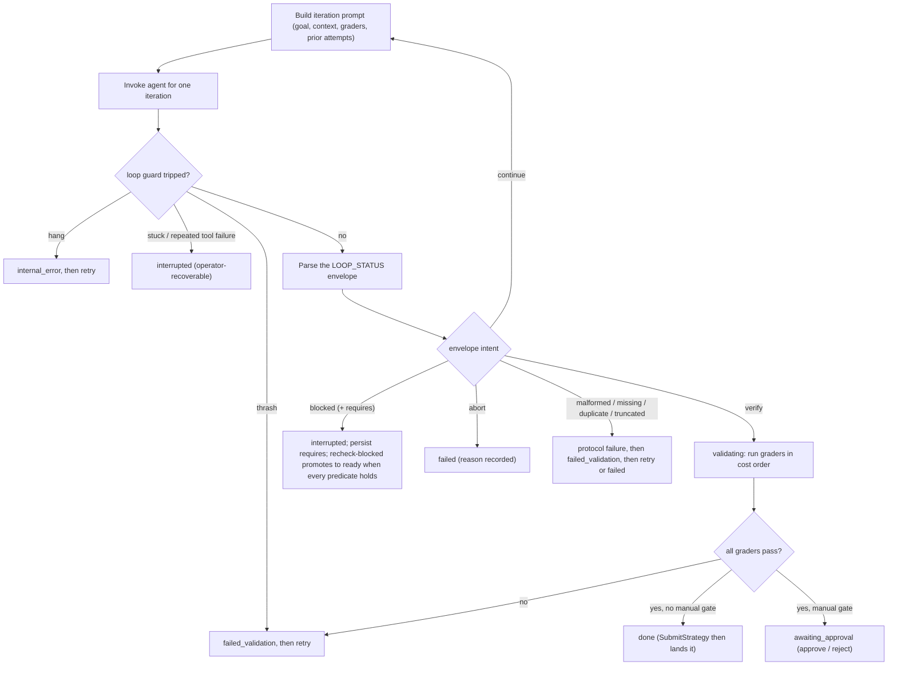

# Loop

The loop is the control plane around an AI coding agent. The agent is the brain; the loop owns the execution lifecycle of a single [task](task-schema.md).

It does not queue, plan, or decompose work. It runs one task: invoke the agent, interpret its signals, verify completion claims, record history, and expose intervention points.

## Responsibilities

- Invoke the agent and carry context across iterations
- Own [lifecycle](task-lifecycle.md) transitions (the agent never mutates state directly)
- Detect iteration state from SDK signals and the intent envelope
- Verify completion claims before reaching `done`
- Preserve attempt history and failure context
- Emit structured events for telemetry

## The iteration loop

One iteration: build the prompt, invoke the agent, then route on the loop guards and the agent's intent envelope. `continue` loops; every other outcome drives a [lifecycle](task-lifecycle.md) transition. `intent=verify` starts `validating`, **not** `done` — verification outcome and retry policy are separate decisions.



## State detection

Detection combines SDK-native signals (`StopReason`, hooks, typed messages) with a minimal intent envelope from the agent. Judgment-heavy logic — the verifier, thrash analysis, crash classification — lives in pluggable components the loop calls into, not in the core state machine.

| State | Description | SDK surface | Loop service |
|---|---|---|---|
| `done` | Agent's turn ended cleanly and it believes the work is complete. Candidate for verification, not final. | `AssistantMessage.StopReason == "end_turn"` with no pending `ToolUseBlock`; `ResultMessage` with `IsError: false` | Run the task's graders in cost order and promote to lifecycle `done` only on all-pass. When automated graders all pass and the task declares any `ManualGrader`, the attempt is finalized `succeeded` and the lifecycle parks at `AWAITING_APPROVAL` instead of promoting to `done`; an operator resolves each gate out-of-band via `flywheel approve` / `flywheel reject`. |
| `working` | Agent is making productive progress — tool calls succeeding, novel actions, diff growing. Default healthy state. | `PostToolUse` hook fires; `ToolResultBlock.IsError == false`; `TaskProgressMessage` arriving | **Simple:** reset watchdog timer, append event to progress window, continue. Pure bookkeeping. |
| `blocked_explicit` | Agent has declared it needs external input to proceed. | Text content in `AssistantMessage`; `NotificationArrived` hook; simplified intent envelope | **Simple** if the intent envelope is a closed enum (`blocked`, `verify`, `continue`, `abort`) — trivial parse and pause. **Open question:** how the `reason` field is handled without it becoming free-form conditional logic inside the loop. |
| `blocked_implicit` | Agent is stuck but doesn't know it — same tool failing repeatedly, same permission denied, same question re-asked. | `PostToolUseFailure` hook; `ToolResultBlock.IsError == true`; `ResultMessage.PermissionDenials` | **Shipped — mechanical case:** counter keyed on `(tool_name, sha256(input))` in `flywheel.loop_guard`, tripped after repeated consecutive `is_error` results and routed to `interrupted` (blocked, operator-recoverable) via the harness `STUCK` path. Permission denials surfaced as `is_error` tool results feed the same counter; a dedicated resource-keyed `(tool_name, resource)` counter is still deferred. **TODO — "same question re-asked":** requires semantic similarity between assistant text blocks; not deterministic. Research options include embedding-model similarity with a threshold study; each requires its own research phase. |
| `thrashing` | Tool calls succeed but produce no net progress — same files edited with zero-sum diffs, input novelty collapsing. | `PostToolUse` hook with tool name + input; `WithFileCheckpointing` for diff observation | Three sub-problems with different difficulty. **(a) Shipped — tuple repetition** across a rolling window via `flywheel.loop_guard`'s `THRASH` verdict, routed through `failed_validation` -> the existing retry policy. **TODO (b) — net-diff-near-zero:** needs filesystem snapshots and a "meaningful change" heuristic (whitespace? comments? line count threshold?). **TODO (c) — input novelty score:** needs a distance metric over structured inputs, which is research. Each remaining sub-problem requires its own research phase. |
| `hanging` | No output of any kind for longer than threshold — not thinking, not rate-limited, just silent. | Streaming iterator delivers messages one-by-one; `ThinkingBlock` and `RateLimitEvent` are valid liveness signals | **Shipped — mechanism:** an asyncio watchdog in the harness resets on every SDK message (including `ThinkingBlock` and `RateLimitEvent`); on silence past `hang_timeout_seconds` it cancels the in-flight invocation and routes the attempt to `internal_error`. **TODO — threshold default value:** `hang_timeout_seconds` ships as `None` (disabled). A grounded default still requires research informed by extended-thinking budgets and telemetry; the watchdog only runs once an operator supplies a value. |
| `rate_limited` | Agent is waiting on API quota. Looks like hanging but is transient and expected. | `RateLimitEvent` with `RateLimitInfo` | **Simple:** flip a `rate_limited` flag that the watchdog checks before firing; compute ETA from `RateLimitInfo.ResetsAt` and emit to operator surface. Clear flag on next non-rate-limit message. |
| `context_exhausted` | Conversation outgrew the context window. | `StopReason == "max_tokens"` on assistant or result; `Client.GetContextUsage()` approaching cap | **Simple — detection.** **TODO — recovery policy:** compacting (via `PreCompact` hook), summarize-and-restart, and fork-with-smaller-context are genuinely different strategies with different correctness tradeoffs. No default or sequencing — each candidate strategy requires its own research phase. |
| `budget_exceeded` | Hit configured turn or cost ceiling. | `WithMaxTurns` / `WithMaxBudgetUSD` enforce; `ResultMessage.NumTurns` and `TotalCostUSD` for observation | **Simple:** SDK halts the agent automatically. Loop records cause, applies retry policy from task config (`max_retries`, `backoff`). Straightforward config-driven logic. |
| `crashed` | Subprocess died, SDK errored, or transport failed. | Iterator returns `err`; global `Error` hook; context cancellation | **Simple — recording and surfacing.** **TODO — classification between infra / agent / protocol.** Error types from the SDK don't cleanly map to those categories; classification likely needs to inspect error wrapping, exit codes, and whether a partial envelope was received. Candidate heuristics (context deadline → infra; non-zero exit without iterator error → agent; malformed envelope → protocol) are research points, not defaults; a corpus of real crashes is needed before any classifier can be designed. |

## Iteration envelope

The envelope carries agent intent only; observed state comes from SDK signals per the detection map above. Every iteration ends with a JSON envelope delimited by `<!-- LOOP_STATUS -->`.

```html
<!-- LOOP_STATUS -->
{
  "intent": "verify" | "blocked" | "continue" | "abort",
  "reason": "..."
}
<!-- /LOOP_STATUS -->
```

`intent=blocked` MUST additionally carry a non-empty `requires` array describing what would unblock the lifecycle. Non-blocked intents omit `requires`; any payload-level `requires` on `verify`, `continue`, or `abort` is ignored. Three predicate shapes are recognized in v1 (and only these three):

```json
{"type": "command_grader", "name": "<grader-name>"}
{"type": "file_exists", "path": "<path>", "present": true}
{"type": "env_var_set", "name": "<ENV_VAR>"}
```

`file_exists.present` defaults to `true` when omitted. A blocked envelope without `requires`, with a non-list `requires`, with an empty list, or with an entry of unknown `type` or missing per-type field is a protocol failure.

The envelope is untrusted protocol input. The harness must handle malformed JSON, missing fences, duplicates, truncation, and contradictory claims as first-class cases.

## Rubric verdict envelope

Rubric graders run an LLM-as-judge in a fresh `claude-agent-sdk` session and require the judge to terminate its response with one fenced JSON block:

```html
<!-- RUBRIC_VERDICT -->
{"passed": true, "summary": "<one or two sentences>", "unknown": false}
<!-- /RUBRIC_VERDICT -->
```

- `passed` (bool, required) — true if every assertion holds.
- `summary` (str, required) — brief rationale; empty string accepted.
- `unknown` (bool, optional, default false) — set true only when evidence is insufficient. Counts as a pass for lifecycle purposes; surfaced via `harness.rubric_unknown`.

The verdict is untrusted protocol input. The parser returns a closed taxonomy and each non-valid variant routes through `INTERNAL_ERROR` (judge-infrastructure failure, retry-eligible):

- `MissingVerdict` — no opening fence in the judge's response.
- `TruncatedVerdict` — opening fence with no matching closing fence.
- `DuplicateVerdict` — more than one fence pair (guards against prompt-injection style fake verdicts).
- `MalformedVerdict` — JSON decode failure or field-level shape violation (missing/wrong-type `passed`, `summary`, or `unknown`).

When a rubric `passed=false` verdict triggers an auto-retry (`retry_on_fail=True`), its `summary` is carried into the next attempt's prompt as a `# Reviewer feedback` section so the working agent sees the critique on its next iteration.

## Harness behavior

Per-state dispatch is specified by the **Loop service** column of the detection map above. Each detected state maps to a concrete loop action — bookkeeping, watchdog reset, verification orchestration, pause-for-intervention, retry policy, or fail-loud. Remaining TODO subsystems flagged in that column are: thrash sub-problems (b) net-diff and (c) input-novelty, the still-ungrounded `hang_timeout_seconds` default value, fine-grained crash classification, context-recovery policy, and `blocked_implicit` "same question re-asked" semantic detection.

Every harness `EventRecord` and every SDK `Message` observed during an iteration is persisted under a single per-run monotonic sequence; `flywheel.audit` is the canonical replay and live-inspection surface for that stream.

Blocked lifecycles carry their `requires` snapshot on the persisted lifecycle row, and the `flywheel recheck-blocked` CLI subcommand drives `flywheel.harness.recheck_blocked_lifecycle` from outside the loop — by default it scans every `interrupted` lifecycle with a non-null `blocked_requires_json`, evaluates the persisted predicates against the caller's CWD, and applies `interrupted -> ready` for any whose predicates are all satisfied. `--run-id <id>` targets one lifecycle; `--dry-run` reports without transitioning (still emits `harness.recheck_attempted`, never emits `harness.unblocked`). `flywheel status` surfaces the same snapshot as a `blocked_on:` summary on interrupted rows (text) or a `blocked_requires` key on each JSON row.

## Graders

Triggered when the agent claims `completed`. Driven by the task's `graders` list. Run in cost order; first failure inside a type skips the rest of that type and later types.

1. **`command`** — deterministic shell check (tests, build, lint, typecheck, state assertions). MVP: failures retry automatically.
2. **`transcript`** — path-level constraints (`max_turns`, `max_total_tokens`, `max_wall_seconds`). Also enforced as hard limits during the run, not only at grade time. MVP: failures retry automatically.
3. **`rubric`** — separate LLM verifier evaluates natural-language assertions against the goal, diff, and artifacts. MVP: failures pause for operator review.
4. **`manual`** — declared human-approval gate. When the automated graders all pass, the harness finalizes the attempt `succeeded`, parks the lifecycle at `awaiting_approval` on the first manual gate (recorded in `awaiting_manual_ordinal`), and emits `harness.awaiting_approval` with the instruction and pointers to the audit/artifact surfaces. An operator resolves each gate out-of-band via `flywheel approve RUN_ID` / `flywheel reject RUN_ID [--feedback TEXT]` — two verbs on the `control_commands` channel applied by `resolve_manual_approval` on the orchestrator's reactive sweep (a sibling of `recheck_blocked_lifecycle`). Approve writes a `passed=true` manual receipt and either re-parks on the next manual gate or transitions `awaiting_approval -> done`; reject writes a `passed=false` receipt carrying the operator's feedback, transitions `awaiting_approval -> failed_validation`, and lets the existing retry arm drive `-> ready` (consuming retry budget; feedback surfaces in the next attempt's `# Reviewer feedback` prompt section, labeled `manual <name> (operator): ...`) or `-> failed` (exhausted). Gates wait indefinitely; the park is durable across worker restart and exempt from `finalize_stranded_lifecycle`.

A failed grader records `failed_validation`. What happens next is policy.

## In-loop verification gate

A phase that adds a new loop path cannot archive until that path has run end-to-end against real `orchestrate` and a real migrated store. `archive_completed_phases` derives a loop-path marker from the phase's cumulative diff vs base and refuses to archive a marked phase without a DONE `in-loop-verification` task or a recorded opt-out. Closes the "graders pass" vs "shipped path ever ran" gap that detonated phase 08 (schema column never migrated into the live store) and phase 17 (`AWAITING_APPROVAL` path never entered).

### Trigger set

Any of the following symbol-level signals in the phase diff marks it loop-path-bearing:

| # | Signal | Decidable test |
| - | ------ | -------------- |
| 1 | New `Status`/`Outcome` member or transition-rule entry | added enum member / new `_VALID_EDGES` entry in `lifecycle.py` |
| 2 | New `ADD COLUMN` / table in `_schema/*.sql` | DDL on lifecycles, grader_results, events, attempts, control_commands |
| 3 | New `Grader` union variant | new variant in `task.py`'s `Grader` union or new `grader_*.py` dispatched by the harness |
| 4 | New store-contract / resolver entry | new method on a `store_protocols.py` Protocol AND a dispatch registration |
| 5 | New control-command verb | new `CONTROL_COMMAND_*` constant in `invoker_client.py` |

### in-loop-verification task

A `command` grader that drives a fixture through the real `orchestrate`/harness via the injectable invoker seam with a scripted envelope. Must exercise both ends of the new path (e.g. harness park AND reactive-sweep apply) and, for schema-touching features, seed a `v(N-1)` store fixture and assert via `SqliteStore` after running the real forward migration — a fresh current-schema store does NOT satisfy the gate (phase 08's exact blind spot). Never touches `.flywheel/flywheel.sqlite`.

### Opt-out artifact

A false-positive marker (e.g. docstring fix in a watched file, reverted-within-phase column) is downgraded by committing `active/<phase>/loop-path-exempt.md` with structured front-matter recording phase, author, and reason. The loop-retro audit (`/fw-retro`, shipped via `flywheel init --skills`; flywheel's own repo runs the internal `/audit-phase`) re-derives the marker from the diff and flags opt-outs whose diff in fact added a watched symbol.

## Intervention

Agent-reported:

- **Blocked** — agent-reported need for external input. Resumes via `ready`.
- **Interrupted** — external pause/stop. Resumes via `ready`.

Loop-initiated (detected, not self-reported by the agent):

- **blocked_implicit** — loop detected repeated tool failure or permission denials; agent did not self-report.
- **thrashing** — loop detected no-net-progress pattern (same `(tool, target)` tuple repeats, zero-sum diffs).
- **hanging** — watchdog timer expired with no message traffic and no valid liveness signal.

## Failure classes

Recorded distinctly even when lifecycle states overlap:

| Class              | Cause                                                               |
| ------------------ | ------------------------------------------------------------------- |
| Task failure       | Agent could not complete                                            |
| Validation failure | Completion claim disproved by any grader (command, transcript, rubric, manual) |
| Protocol failure   | Malformed, missing, duplicate, or truncated envelope                |
| Infrastructure     | SDK, subprocess, verifier, or storage failure                       |

Each detected state maps to a primary class. Notes capture classification shifts that can only be settled post-mortem:

| State                       | Primary class      | Notes                                                                 |
| --------------------------- | ------------------ | --------------------------------------------------------------------- |
| `blocked_explicit`          | Task failure       | —                                                                     |
| `blocked_implicit`          | Task failure       | —                                                                     |
| `thrashing`                 | Task failure       | —                                                                     |
| `hanging`                   | Infrastructure     | Indistinguishable from subprocess failure at detection time           |
| `context_exhausted`         | Task failure       | Reclassify to Infrastructure if recovery policy fails repeatedly      |
| `budget_exceeded`           | Task failure       | —                                                                     |
| `crashed`                   | Infrastructure     | Refine to Protocol on malformed envelope, Task on clean non-zero exit |
| Malformed envelope          | Protocol failure   | —                                                                     |
| Grader rejection            | Validation failure | —                                                                     |

`rate_limited` is transient and not a failure class. `working` and pre-verification `done` are not failures either.

## Non-goals

- Not a queue — does not schedule or prioritize across tasks
- Not a planner — does not decompose goals into subtasks
- Not a UI — operational surfaces are minimal; richer views consume the event stream

## Surface

A Python library, embeddable in CI pipelines, task queues, and orchestrators.

## Requirements

- [`claude-agent-sdk`](https://github.com/anthropics/claude-agent-sdk-python) — the execution substrate for driving Claude Code as a subprocess. The loop invokes the agent through this SDK.
