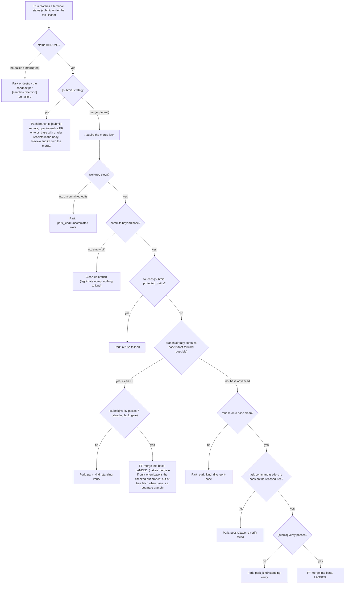

# Strategy

Strategy is the work between "agent finished" and "result committed / merged / submitted" — branches, worktrees, commits, merges, submissions, review gates.

**Strategy lives in the consumer of the loop, not inside the loop.** `flywheel_core.harness` owns the lifecycle, envelopes, graders, attempts, and events. Strategy lives one layer up because it is task-class-specific (code tasks need commits; research / config / non-code tasks don't) and the loop is task-agnostic by design (see [vision.md](vision.md), "What it is not").

## The seam

The named seam is `flywheel_orchestrator.SubmitStrategy` (`_strategy.py`): a structural protocol bundling the two hooks `orchestrate` calls around every run. No base class — any object with conforming methods satisfies the protocol, passed as `orchestrate(strategy=...)` (or as the standalone `prepare_sandbox`/`submit` callables). Selecting a built-in strategy by name (the `flywheel.toml` `[submit] strategy` key) routes through the `SUBMIT_STRATEGIES` plugin registry (`flywheel_worktree._submit_registry`), which maps `merge`/`pr`/`phase` to their submitters.

| Hook              | When                                | Contract                                                                                       |
| ----------------- | ----------------------------------- | ---------------------------------------------------------------------------------------------- |
| `prepare_sandbox` | before the run                      | Returns the directory the task runs in (worktree, container mount, plain dir). May raise: the task is skipped for the session, peers are never starved. |
| `submit`          | after the run, lease still held     | Acts on the terminal status (`SubmitRequest` carries the validated `Task`, run id, status, sandbox). MUST NOT raise — it records its own outcome.       |

`submit` running under the task's lease means two workers never land the same task concurrently. The core loop also exposes the `events` table (`harness.*`, streaming) and the terminal `lifecycle.status` row for strategies that observe rather than wrap.

### SandboxHandle

`prepare_sandbox`'s return type is widened to `Path | SandboxHandle` (`_strategy.py:172`). A bare `Path` (every worktree backend) is adapted by the orchestrator via `_as_handle` (`_strategy.py:136`) to an empty `SandboxHandle(path=...)` — byte-identical back-compat. A non-worktree backend returns a populated handle so the orchestrator runs the agent *inside* the provisioned environment (`SandboxHandle`, `_strategy.py:94`):

| Field | Type | Purpose |
| --- | --- | --- |
| `path` | `Path` | The host worktree. Landing/merge still runs host-side. |
| `env_contribution` | `Mapping[str, str]` | Extra env merged onto the policy-resolved `agent_env`; the handle wins on key collision (a container's `PATH`, a forwarded socket). |
| `invoke_wrapper` | `Callable[[InvokeFunc \| None], InvokeFunc] \| None` | Wraps the run's `InvokeFunc` so the iteration executes in the backend (e.g. `docker exec`) instead of the worker process. `None` runs in-process. |
| `teardown` | `Callable[[], None] \| None` | Disposes the provisioned environment after the run lands. |

`teardown` is called best-effort after `submit`, before the lease releases, and **MUST NOT raise** (a teardown failure never unwinds the worker). It is per-task by construction — the provider captures the sandbox identity in the `prepare_sandbox` closure, which is why it lives on the handle rather than on `SubmitStrategy` (a shared strategy instance could not key teardown to one task's sandbox).

## Shipped strategies

One `SubmitStrategy` per landing policy, forming a trust ladder consumers climb as graders earn trust. Selected per repo via `flywheel.toml` `[submit] strategy`.

- **`merge`** (default) — `flywheel_worktree.worker.GitWorktreeSubmitter`, full autonomy. Each task runs in its own git worktree on branch `flywheel/<phase>/<task-id>`, branched off the worker's starting branch; on `done` the branch is fast-forward-merged back into that base and the worktree removed, while failed/interrupted worktrees are parked for forensics. If the base advanced under a finished task, the branch is rebased once and its command graders re-run against the rebased tree before the merge — nothing lands that was not verified against the exact base it lands on.
- **`pr`** — `flywheel_worktree.pr.GitPullRequestSubmitter`, review-gated. Same provisioning; on `done` the branch is pushed to the remote and a PR opened (or refreshed) with the run's grader receipts rendered in the body, so reviewers see how "done" was decided. Nothing merges locally — review/CI own the merge. Park semantics are identical.
- **`phase`** — `flywheel_worktree.worker.PhaseBranchSubmitter` (spec 00079), phase-scoped review. The merge strategy's full verify ladder, but each task fast-forwards onto a per-phase integration branch `flywheel/phase/<phase>` (forked from the true base on the phase's first landing) instead of the base itself; the true base never advances locally. A completed phase is published as one aggregate PR (`PhasePrPublisher`) and archives only once that PR merges.
- **`ContainerSubmitStrategy`** (`flywheel_container._submit`) — container isolation. *Composes* an inner landing strategy (`merge` or `pr`) rather than replacing one: the agent runs in a Docker container against the bind-mounted worktree while landing stays host-side. Selected via `[sandbox] backend = "container"` (not `[submit] strategy`); the worker wraps the inner submitter in it via `maybe_wrap_for_backend`. `prepare_sandbox` returns a `SandboxHandle` whose `invoke_wrapper` `docker exec`s the agent CLI in the container and whose `teardown` disposes it; `submit` delegates to the inner strategy unchanged. See [container-backend.md](container-backend.md) and [sandbox.md](sandbox.md).

All shipped strategies honor `[submit] protected_paths`: a finished branch touching the verification surface (grader configs, CI) never lands, regardless of strategy. The seam keeps all git in the consumer — flywheel core stays git-free.

## Risk-tiered routing (`[[submit.tiers]]`)

With `[[submit.tiers]]` configured (spec 00080), the strategy applied to each DONE task is a function of its diff, not a repo-global constant. `TierRoutingSubmitter` (`flywheel_worktree.tiering`) provisions like `merge` (worktrees fork from the true base) and classifies the branch's merge-base-scoped changed files at submit time against the operator's path rules:

- tier 0 routes to `merge` (direct land), tier 1 to `phase`, tier 2 to `pr` — delegates built through the same registry; the highest tier of any touched file wins.
- A file matching no rule defaults to **tier 1** — a newly invented path is never a silent direct-merge lane.
- Classification reads only the policy the **worker process** loaded; the policy file itself always classifies at the highest tier, so a branch editing the rules cannot cheapen its own route.
- `protected_paths` outranks every tier: the routed strategy still runs its own protected-path refusal first. Protection is refusal, not routing.
- Each decision (per-file tiers, winning tier, strategy) is recorded on the run's ledger as a `LandingRouted` event before the routed strategy runs.

Absent `[[submit.tiers]]`, landing is byte-identical to the configured `[submit] strategy` with no classifier in the path.

## How a finished task lands

The decision `submit` makes for a DONE run, under the merge lock (which serializes all base mutations so two workers never land concurrently). Every leaf is either a land or a park-with-reason — nothing lands that was not verified against the exact base it lands on.

`[submit] base` unset (the default) lands onto the branch you have checked out (in-tree FF); set it to a *separate* branch you do not have checked out to land out-of-tree. `[submit] verify` (spec 00064) is the repo-wide standing build gate; `park_kind` values are queryable on the run's ledger and surfaced by `flywheel status` (see [configuration.md](configuration.md)).

## Future strategies

Container-based isolation is shipped — see `ContainerSubmitStrategy` above. The remaining futures all fit the same two hooks: emit a patch artifact (touch no refs), auto-merge on green, non-git submission flows. flywheel does not need to know they exist.
