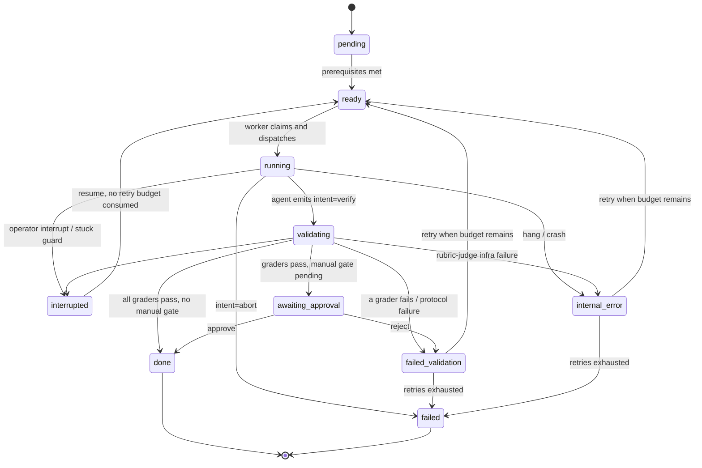

# Task Lifecycle

The lifecycle tracks a task's execution state from creation to terminal outcome. The schema says *what* to do, the lifecycle tracks *what happened*.

## States

| Status               | Meaning                                             |
| -------------------- | --------------------------------------------------- |
| `pending`            | Task exists but prerequisites not met               |
| `ready`              | All prerequisites satisfied, eligible for execution |
| `running`            | Agent is actively working                           |
| `validating`         | Agent finished, validation checks running           |
| `awaiting_approval`  | Parked at a manual-approval gate (resumable)        |
| `failed_validation`  | Validation failed (retryable)                       |
| `internal_error`     | Agent invocation crashed (retryable)                |
| `done`               | Terminal: work completed successfully               |
| `failed`             | Terminal: unrecoverable failure                     |
| `interrupted`        | Execution halted externally (resumable)             |

## State machine

This diagram is the exact set of legal edges the harness enforces (`_VALID_EDGES` in `flywheel_core.lifecycle`); any other transition raises `LifecycleTransitionError`.

`validating -> internal_error` covers rubric-judge infrastructure failures (SDK crash, parse failure, missing/duplicate/truncated verdict envelope); the existing retry budget applies just as it does for `running -> internal_error`.

Key rules:
- `done` and `failed` are terminal — no transitions out
- `failed_validation` and `internal_error` can transition back to `ready` (consuming retry budget)
- `interrupted` always resumes via `ready` and does **not** consume retry budget
- `awaiting_approval` (`Status.AWAITING_APPROVAL`) parks the lifecycle at a manual-approval gate; entering it does **not** consume retry budget, and the awaiting attempt is finalized `succeeded` at gate entry (the human wait is not part of attempt duration). Resolution is out-of-band via `approve` / `reject` control commands. The `awaiting_manual_ordinal` column records which gate is pending and is cleared centrally inside `Lifecycle.transition_to` on every `-> ready`, `-> done`, and `-> failed_validation` edge — the same set of edges that clear `blocked_requires_json`. The SIGKILL/OOM/reboot backstop (`finalize_stranded_lifecycle`) treats `AWAITING_APPROVAL` as a legitimate park and does not finalize it.
- **`Outcome.SUCCEEDED` ⟹ all automated graders passed, not that the lifecycle reaches `done`.** A lifecycle reaches `done` iff its attempt is `succeeded` *and* every manual gate is approved. A `succeeded` attempt may therefore precede a retry when an operator rejects a gate: the rejection is recorded as a `passed=false` manual `GraderResultRecord` and a `validating -> awaiting_approval -> failed_validation` transition, while the attempt's outcome continues to reflect that the agent passed automated verification.
- Transitioning to `failed`, `failed_validation`, or `internal_error` requires the `Error` field to be set
- Operator interruption routes through `interrupted` so the retry budget is preserved; the attempt's `Outcome` is `internal_error`. Worker-process SIGINT/SIGTERM emits `harness.interrupted` (classification `worker_interrupted`) from the in-band finalizer at the harness attempt boundary; command-grader SIGINT/SIGTERM emits `harness.crash` (classification `grader_signaled`); the SIGKILL/OOM/reboot backstop `finalize_stranded_lifecycle` still emits `harness.crash` (classification `worker_interrupted`) on the next orchestrate startup
- `interrupted -> ready` can be driven by three callers: `run_task` entry-time normalization (SIGINT-pause resume), explicit operator promotion, and `flywheel.harness.recheck_blocked_lifecycle` (envelope-blocked recovery once every persisted `requires` predicate is satisfied). Every `-> ready` edge clears `blocked_requires_json` centrally inside `Lifecycle.transition_to`.

## Lifecycle struct

| Field             | Purpose                                   |
| ----------------- | ----------------------------------------- |
| `task_id`         | Links back to the task definition         |
| `run_id`          | Identifies this execution run             |
| `worker_id`       | Which worker is executing                 |
| `status`          | Current state                             |
| `timestamps`      | When each major transition occurred       |
| `version`         | Optimistic concurrency control            |
| `retries`         | How many times this task has been retried |
| `error`           | Current error (cleared on retry)          |
| `agent_output`    | Last output from the agent                |
| `attempts`        | Full history of all attempts              |
| `session_id`      | Agent session for resumption              |
| `artifacts_dir`   | Where attempt artifacts are stored        |
| `blocked_requires_json` | Snapshot of the unsatisfied envelope `requires` predicates while blocked; cleared on every `-> ready` edge |
| `awaiting_manual_ordinal` | Which manual gate is pending while parked at `awaiting_approval`; cleared on `-> ready` / `-> done` / `-> failed_validation` |
| `source`          | Opaque provenance label for the work item (task-file path, tracker ref); set once at seed, never interpreted by core |

## Attempts

Each execution attempt is recorded as an `Attempt` with:

- `number` — sequential attempt index
- `started_at` / `ended_at` — wall clock duration
- `outcome` — one of: `succeeded`, `validation_failed`, `agent_error`, `cancelled`, `internal_error`, `recovered`
- `agent_output`, `error` — context for debugging
- `agent_context` — model id, model version, agent-SDK version, prompt-template hash; lets later analysis distinguish model swaps from regressions
- `run_id` — groups attempts within the same run

Per-grader pass/fail detail lives in `grader_results`, keyed by `(run_id, attempt_number)`. Each row snapshots the grader's spec at run time and records its result, so the audit trail survives later task edits.

## Retries

A task is eligible for retry when:
1. Status is `failed_validation` or `internal_error`
2. `retries < max_retries` (configurable)

On retry, the lifecycle transitions back to `ready`, increments `retries`, and clears transient error state. The full attempt history is preserved. Agent-invocation crashes (`internal_error`) and validation failures share the same retry budget — crashes do not get a separate budget.

`ConsecutiveFailedRuns` counts sequential failed runs (grouped by `run_id`) from the tail of the attempts list. This drives circuit-breaker logic.
